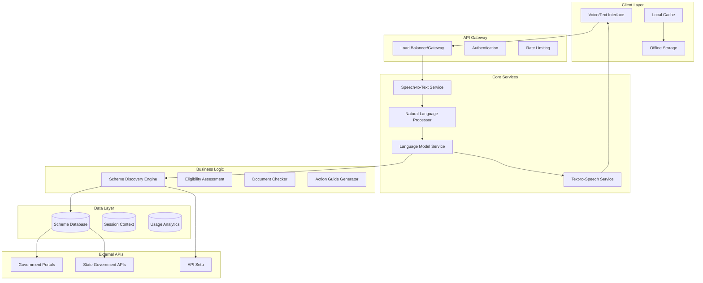

# Design Document: Sahaay AI

## Overview

Sahaay AI is a voice-first, AI-powered civic access assistant designed to help Indian citizens discover and access government schemes through natural language interaction in local languages. The system employs a cascading STT → LLM → TTS architecture optimized for low-bandwidth environments, with offline-first capabilities and multilingual support.

The architecture prioritizes accessibility, reliability, and cultural sensitivity while maintaining simplicity for users with limited digital literacy. The system integrates with government data sources through API Setu and other official channels, providing real-time scheme information while ensuring privacy and data protection.

## Architecture

### High-Level Architecture



### Service Architecture Pattern

The system follows a microservices architecture with the following key principles:

1. **Offline-First Design**: Core functionality works without internet connectivity using cached data
2. **Progressive Enhancement**: Features gracefully degrade based on network availability
3. **Language-Agnostic Core**: Business logic separated from language-specific processing
4. **Stateless Services**: Each service maintains no session state for horizontal scalability
5. **Circuit Breaker Pattern**: Automatic fallback when external services are unavailable

## Components and Interfaces

### 1. Voice Interface Component

**Responsibilities:**
- Speech-to-text conversion with language detection
- Text-to-speech synthesis in local languages
- Audio compression for low-bandwidth transmission
- Fallback to text input when voice fails

**Key Interfaces:**
```typescript
interface VoiceInterface {
  convertSpeechToText(audioBlob: Blob, language?: string): Promise<TranscriptionResult>
  convertTextToSpeech(text: string, language: string, voice?: VoiceProfile): Promise<AudioBlob>
  detectLanguage(audioBlob: Blob): Promise<LanguageCode>
  compressAudio(audioBlob: Blob, quality: CompressionLevel): Promise<Blob>
}

interface TranscriptionResult {
  text: string
  confidence: number
  detectedLanguage: string
  alternatives?: string[]
}
```

**Technology Stack:**
- **STT**: Whisper multilingual model for offline capability, with cloud STT for enhanced accuracy
- **TTS**: Local synthesis using lightweight models, cloud TTS for natural voices
- **Audio Processing**: WebRTC for real-time processing, Opus codec for compression

### 2. Natural Language Processor

**Responsibilities:**
- Intent recognition from user queries
- Entity extraction (location, demographics, scheme names)
- Context management across conversation turns
- Language translation and localization

**Key Interfaces:**
```typescript
interface NaturalLanguageProcessor {
  processQuery(text: string, context: ConversationContext): Promise<ProcessedQuery>
  extractEntities(text: string, language: string): Promise<EntitySet>
  translateText(text: string, fromLang: string, toLang: string): Promise<string>
  maintainContext(sessionId: string, query: ProcessedQuery): Promise<ConversationContext>
}

interface ProcessedQuery {
  intent: IntentType
  entities: EntitySet
  confidence: number
  language: string
  normalizedText: string
}
```

**Implementation Approach:**
- **Intent Classification**: Fine-tuned multilingual BERT model for government scheme intents
- **Entity Recognition**: Custom NER model trained on Indian government terminology
- **Translation**: Combination of local models for common phrases and cloud translation for complex queries

### 3. Scheme Discovery Engine

**Responsibilities:**
- Match user needs to relevant government schemes
- Rank schemes by relevance and eligibility likelihood
- Handle scheme search by name or category
- Provide scheme summaries and key benefits

**Key Interfaces:**
```typescript
interface SchemeDiscoveryEngine {
  findRelevantSchemes(query: ProcessedQuery, userProfile: UserProfile): Promise<SchemeMatch[]>
  searchSchemeByName(schemeName: string, language: string): Promise<SchemeDetails>
  getSchemesByCategory(category: SchemeCategory, location: Location): Promise<SchemeDetails[]>
  rankSchemesByRelevance(schemes: SchemeDetails[], userProfile: UserProfile): SchemeMatch[]
}

interface SchemeMatch {
  scheme: SchemeDetails
  relevanceScore: number
  eligibilityLikelihood: number
  matchingCriteria: string[]
}
```

**Matching Algorithm:**
- **Semantic Matching**: Vector embeddings for scheme descriptions and user queries
- **Rule-Based Filtering**: Hard constraints like age, income, location
- **ML Ranking**: Trained model considering user demographics and scheme popularity

### 4. Eligibility Assessment Engine

**Responsibilities:**
- Evaluate user eligibility for specific schemes
- Generate clarifying questions for missing information
- Explain eligibility decisions in simple language
- Suggest alternative schemes when ineligible

**Key Interfaces:**
```typescript
interface EligibilityEngine {
  assessEligibility(scheme: SchemeDetails, userProfile: UserProfile): Promise<EligibilityResult>
  generateQuestions(scheme: SchemeDetails, knownInfo: UserProfile): Promise<Question[]>
  explainEligibility(result: EligibilityResult, language: string): Promise<string>
  suggestAlternatives(scheme: SchemeDetails, userProfile: UserProfile): Promise<SchemeDetails[]>
}

interface EligibilityResult {
  isEligible: boolean
  confidence: number
  missingRequirements: Requirement[]
  satisfiedCriteria: Criterion[]
  explanation: string
}
```

### 5. Document Checker Service

**Responsibilities:**
- Provide complete document checklists for schemes
- Explain document purposes in simple terms
- Suggest document alternatives when available
- Indicate mandatory vs. optional documents

**Key Interfaces:**
```typescript
interface DocumentChecker {
  getRequiredDocuments(scheme: SchemeDetails): Promise<DocumentRequirement[]>
  explainDocumentPurpose(document: DocumentType, language: string): Promise<string>
  getDocumentAlternatives(document: DocumentType): Promise<DocumentType[]>
  validateDocumentCompleteness(documents: DocumentType[], scheme: SchemeDetails): Promise<ValidationResult>
}

interface DocumentRequirement {
  documentType: DocumentType
  isMandatory: boolean
  purpose: string
  alternatives: DocumentType[]
  format: DocumentFormat
}
```

### 6. Action Guide Generator

**Responsibilities:**
- Generate step-by-step application instructions
- Provide office locations and contact information
- Include deadlines and processing timeframes
- Offer both online and offline application paths

**Key Interfaces:**
```typescript
interface ActionGuideGenerator {
  generateActionPlan(scheme: SchemeDetails, userLocation: Location): Promise<ActionPlan>
  getOfficeInformation(scheme: SchemeDetails, location: Location): Promise<OfficeInfo[]>
  getApplicationMethods(scheme: SchemeDetails): Promise<ApplicationMethod[]>
  estimateProcessingTime(scheme: SchemeDetails, method: ApplicationMethod): Promise<TimeEstimate>
}

interface ActionPlan {
  steps: ActionStep[]
  estimatedDuration: string
  deadlines: Deadline[]
  alternativePaths: ActionStep[][]
}
```

## Data Models

### Core Entities

```typescript
interface SchemeDetails {
  id: string
  name: MultilingualText
  description: MultilingualText
  category: SchemeCategory
  eligibilityCriteria: EligibilityCriterion[]
  benefits: Benefit[]
  applicationProcess: ApplicationProcess
  requiredDocuments: DocumentRequirement[]
  contactInformation: ContactInfo[]
  lastUpdated: Date
  source: DataSource
}

interface UserProfile {
  sessionId: string
  demographics: {
    ageRange?: AgeRange
    incomeRange?: IncomeRange
    location?: Location
    category?: SocialCategory
    occupation?: Occupation
  }
  preferences: {
    language: string
    interactionMode: 'voice' | 'text' | 'mixed'
  }
  conversationHistory: ConversationTurn[]
}

interface ConversationContext {
  sessionId: string
  currentIntent: IntentType
  activeSchemes: string[]
  collectedInformation: Partial<UserProfile>
  conversationState: ConversationState
  lastInteraction: Date
}

interface MultilingualText {
  [languageCode: string]: string
}
```

### Scheme Categories and Types

```typescript
enum SchemeCategory {
  AGRICULTURE = 'agriculture',
  EDUCATION = 'education',
  HEALTHCARE = 'healthcare',
  EMPLOYMENT = 'employment',
  HOUSING = 'housing',
  SOCIAL_WELFARE = 'social_welfare',
  FINANCIAL_INCLUSION = 'financial_inclusion',
  DIGITAL_SERVICES = 'digital_services'
}

enum IntentType {
  DISCOVER_SCHEMES = 'discover_schemes',
  CHECK_ELIGIBILITY = 'check_eligibility',
  GET_DOCUMENTS = 'get_documents',
  GET_PROCESS = 'get_process',
  SEARCH_SCHEME = 'search_scheme',
  GET_HELP = 'get_help'
}
```

Now I need to use the prework tool to analyze the acceptance criteria before writing the Correctness Properties section.

## Correctness Properties

*A property is a characteristic or behavior that should hold true across all valid executions of a system—essentially, a formal statement about what the system should do. Properties serve as the bridge between human-readable specifications and machine-verifiable correctness guarantees.*

### Voice Interface Properties

**Property 1: Speech-to-text accuracy threshold**
*For any* valid audio input in supported languages, the speech-to-text conversion should achieve at least 85% accuracy
**Validates: Requirements 1.1**

**Property 2: Text-to-speech output generation**
*For any* text response and supported language, the system should generate valid audio output in the specified language
**Validates: Requirements 1.2**

**Property 3: Voice input fallback mechanism**
*For any* failed or unclear voice input, the system should automatically offer text input as an alternative
**Validates: Requirements 1.3**

**Property 4: Context preservation across input modalities**
*For any* conversation where users switch between voice and text input, the conversation context should remain consistent and complete
**Validates: Requirements 1.4**

### Scheme Discovery Properties

**Property 5: Relevant scheme identification**
*For any* user situation description, when relevant schemes exist, the discovery engine should return at least 3 appropriate government schemes
**Validates: Requirements 2.1**

**Property 6: Complete scheme presentation**
*For any* scheme presented to users, the response should include scheme name, description, and benefits in the user's chosen language
**Validates: Requirements 2.2**

**Property 7: No-results handling**
*For any* query with no matching schemes, the system should provide alternative search suggestions or broader categories
**Validates: Requirements 2.3**

**Property 8: Scheme lookup by name**
*For any* valid government scheme name query, the system should return detailed information about that specific scheme
**Validates: Requirements 2.4**

### Eligibility Assessment Properties

**Property 9: Eligibility questioning process**
*For any* eligibility inquiry, the system should ask relevant qualifying questions using simple, understandable language
**Validates: Requirements 3.1**

**Property 10: Positive eligibility explanation**
*For any* user profile that meets scheme criteria, the system should clearly explain qualification reasons and highlight key benefits
**Validates: Requirements 3.2**

**Property 11: Negative eligibility explanation**
*For any* user profile that doesn't meet scheme criteria, the system should explain missing requirements and suggest alternatives when available
**Validates: Requirements 3.3**

**Property 12: Document-dependent eligibility handling**
*For any* scheme with documentation requirements, the system should list required documents before making eligibility determinations
**Validates: Requirements 3.4**

**Property 13: Complex eligibility criteria processing**
*For any* scheme with complex eligibility rules (income, age, location, category), the system should correctly evaluate all criteria combinations
**Validates: Requirements 3.5**

### Document Management Properties

**Property 14: Complete document checklist provision**
*For any* scheme document request, the system should provide a complete list of all required documents
**Validates: Requirements 4.1**

**Property 15: Document purpose explanation**
*For any* required document, the system should provide a clear explanation of its purpose in simple terms
**Validates: Requirements 4.2**

**Property 16: Document alternatives listing**
*For any* document requirement with acceptable alternatives, the system should list all valid alternative options
**Validates: Requirements 4.3**

**Property 17: Document format specification**
*For any* document requiring specific formats or certifications, the system should clearly specify these requirements
**Validates: Requirements 4.4**

**Property 18: Document requirement classification**
*For any* scheme, the system should correctly classify each document as mandatory or optional
**Validates: Requirements 4.5**

### Action Guidance Properties

**Property 19: Sequential action plan generation**
*For any* next steps request, the system should provide actions in a numbered, chronologically ordered sequence
**Validates: Requirements 5.1**

**Property 20: Office information provision**
*For any* scheme requiring office visits, the system should provide office locations, timings, and contact information when available
**Validates: Requirements 5.2**

**Property 21: Online application guidance**
*For any* scheme supporting online applications, the system should provide website links and basic navigation guidance
**Validates: Requirements 5.3**

**Property 22: Deadline highlighting**
*For any* scheme with application deadlines, the system should clearly highlight time-sensitive requirements
**Validates: Requirements 5.4**

**Property 23: Time estimation provision**
*For any* action plan, the system should include estimated timeframes for individual steps and overall processing time
**Validates: Requirements 5.5**

### Language Processing Properties

**Property 24: Multilingual intent recognition**
*For any* query in supported local languages, the system should accurately understand the intent and context
**Validates: Requirements 6.1**

**Property 25: Jargon simplification**
*For any* response containing technical terms or government jargon, the system should translate them into simple, understandable language
**Validates: Requirements 6.3**

**Property 26: Code-switching handling**
*For any* query mixing multiple languages, the system should appropriately handle the code-switching and respond correctly
**Validates: Requirements 6.4**

**Property 27: Conversation consistency**
*For any* multi-turn conversation, the system should maintain consistent terminology and context throughout all interactions
**Validates: Requirements 6.5**

### Low-Bandwidth Optimization Properties

**Property 28: Adaptive response format**
*For any* poor network connectivity scenario, the system should prioritize text responses over voice output to reduce bandwidth usage
**Validates: Requirements 7.1**

**Property 29: Progressive information loading**
*For any* scheme information request, the system should display essential information first and load additional details progressively
**Validates: Requirements 7.2**

**Property 30: Audio compression maintenance**
*For any* voice interaction, the system should compress audio data while maintaining clarity above acceptable thresholds
**Validates: Requirements 7.3**

**Property 31: Offline context preservation**
*For any* connection loss and restoration, the system should cache conversation context and resume seamlessly
**Validates: Requirements 7.4**

### Privacy Protection Properties

**Property 32: Local data processing**
*For any* personal information provided for eligibility checks, the system should process it locally without permanent storage
**Validates: Requirements 8.1**

**Property 33: Session data cleanup**
*For any* conversation end, the system should clear all personal data from temporary memory
**Validates: Requirements 8.2**

**Property 34: Analytics anonymization**
*For any* analytics data collected, the system should store only anonymized usage patterns without personal identifiers
**Validates: Requirements 8.3**

**Property 35: Data usage transparency**
*For any* data usage inquiry, the system should provide clear information about what data is processed and how
**Validates: Requirements 8.4**

**Property 36: Sensitive information restriction**
*For any* interaction, the system should never request sensitive information like Aadhaar numbers, bank details, or passwords
**Validates: Requirements 8.5**

### Accessibility Properties

**Property 37: Voice-only functionality**
*For any* user relying solely on voice interaction, the system should provide complete functionality without requiring visual elements
**Validates: Requirements 9.1**

**Property 38: Text-only functionality**
*For any* user relying solely on text interaction, the system should provide complete functionality with appropriate visual feedback
**Validates: Requirements 9.2**

**Property 39: Voice command navigation**
*For any* navigation or input function, the system should accept voice commands as a complete alternative to manual input
**Validates: Requirements 9.3**

**Property 40: Cross-device navigation consistency**
*For any* device or screen size, the system should provide simple, consistent navigation patterns
**Validates: Requirements 9.5**

### System Reliability Properties

**Property 41: AI service fallback**
*For any* AI service unavailability, the system should provide cached information and clear status updates
**Validates: Requirements 10.1**

**Property 42: Speech recognition error handling**
*For any* speech recognition failure, the system should prompt users to repeat their query or switch to text input
**Validates: Requirements 10.2**

**Property 43: Data availability indication**
*For any* outdated or unavailable scheme information, the system should clearly indicate limitations and suggest alternative sources
**Validates: Requirements 10.3**

**Property 44: Ambiguity resolution**
*For any* ambiguous user query, the system should ask clarifying questions rather than making assumptions
**Validates: Requirements 10.4**

**Property 45: Error-resilient context maintenance**
*For any* temporary error or interruption, the system should maintain conversation context for seamless continuation
**Validates: Requirements 10.5**

## Error Handling

### Error Categories and Responses

**1. Voice Processing Errors**
- **STT Failures**: Automatic fallback to text input with clear user notification
- **TTS Failures**: Display text response with option to retry voice output
- **Language Detection Errors**: Prompt user to specify language or use default language

**2. Network and Connectivity Errors**
- **API Timeouts**: Use cached data with staleness indicators
- **Complete Network Loss**: Switch to offline mode with limited functionality
- **Partial Connectivity**: Prioritize essential data and defer non-critical requests

**3. Data and Content Errors**
- **Missing Scheme Data**: Clearly indicate unavailability and suggest alternatives
- **Outdated Information**: Display last update timestamp and recommend verification
- **Incomplete Eligibility Data**: Request additional information rather than making assumptions

**4. User Input Errors**
- **Ambiguous Queries**: Ask clarifying questions with suggested options
- **Unsupported Languages**: Inform user of supported languages and offer alternatives
- **Invalid Requests**: Provide helpful error messages with guidance on valid requests

### Circuit Breaker Implementation

```typescript
interface CircuitBreakerConfig {
  failureThreshold: number
  recoveryTimeout: number
  fallbackStrategy: FallbackStrategy
}

enum FallbackStrategy {
  CACHED_DATA = 'cached_data',
  SIMPLIFIED_RESPONSE = 'simplified_response',
  OFFLINE_MODE = 'offline_mode',
  ERROR_MESSAGE = 'error_message'
}
```

## Testing Strategy

### Dual Testing Approach

The testing strategy employs both unit testing and property-based testing to ensure comprehensive coverage:

**Unit Tests**: Focus on specific examples, edge cases, and integration points between components. These tests validate concrete scenarios and catch specific bugs in implementation details.

**Property Tests**: Verify universal properties across all inputs through randomized testing. These tests ensure the system behaves correctly across the full range of possible inputs and catch edge cases that might be missed by example-based testing.

Together, unit tests and property tests provide comprehensive coverage where unit tests catch concrete implementation bugs and property tests verify general correctness across all scenarios.

### Property-Based Testing Configuration

**Testing Framework**: Use Hypothesis (Python) or fast-check (TypeScript/JavaScript) for property-based testing implementation.

**Test Configuration**:
- Minimum 100 iterations per property test to ensure adequate randomization coverage
- Each property test must reference its corresponding design document property
- Tag format: **Feature: sahaay-ai, Property {number}: {property_text}**

**Property Test Implementation Requirements**:
- Each correctness property must be implemented by exactly one property-based test
- Property tests should generate diverse, realistic test data representing actual user scenarios
- Tests must validate the universal quantification ("for any") aspect of each property
- Property tests should include edge cases through generator configuration

### Unit Testing Focus Areas

**Specific Examples and Edge Cases**:
- Language-specific voice processing with known audio samples
- Scheme matching with predefined user profiles and scheme databases
- Eligibility assessment with boundary conditions (age limits, income thresholds)
- Document validation with various document type combinations
- Error scenarios with specific failure conditions

**Integration Testing**:
- End-to-end conversation flows across multiple components
- API integration with government data sources
- Offline-to-online synchronization scenarios
- Cross-language conversation continuity

**Performance and Load Testing**:
- Response time validation under various network conditions
- Memory usage during extended conversations
- Concurrent user handling capabilities
- Audio processing latency measurements

### Test Data Management

**Synthetic Data Generation**:
- Multilingual test queries covering all supported languages
- Diverse user demographic profiles for eligibility testing
- Government scheme data with various complexity levels
- Audio samples in different languages and accents

**Privacy-Compliant Testing**:
- Use synthetic personal data that mimics real patterns without containing actual PII
- Anonymized conversation flows based on real usage patterns
- Simulated government scheme data based on public information

### Continuous Testing Integration

**Automated Testing Pipeline**:
- Property tests run on every code change with full 100-iteration cycles
- Unit tests provide fast feedback during development
- Integration tests validate component interactions
- Performance regression testing on key user journeys

**Quality Gates**:
- All property tests must pass before deployment
- Unit test coverage minimum of 80% for core business logic
- Performance benchmarks must meet accessibility requirements (2G network compatibility)
- Security tests must validate privacy protection properties