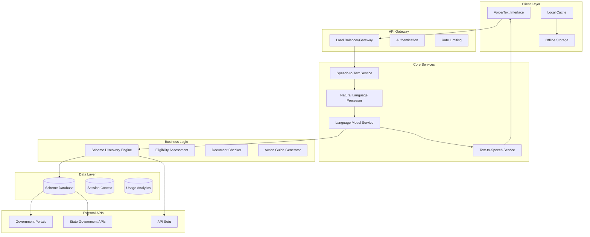

# Design Document: Sahaay AI

## Overview

Sahaay AI is a voice-first, AI-powered civic access assistant designed to help Indian citizens discover and access government schemes through natural language interaction in local languages. The system employs a cascading STT → LLM → TTS architecture optimized for low-bandwidth environments, with offline-first capabilities and multilingual support.

## Architecture

### High-Level Architecture

## Key Components

### 1. Voice Interface Component
- Speech-to-text conversion with language detection
- Text-to-speech synthesis in local languages
- Audio compression for low-bandwidth transmission
- Fallback to text input when voice fails

### 2. Natural Language Processor
- Intent recognition from user queries
- Entity extraction (location, demographics, scheme names)
- Context management across conversation turns
- Language translation and localization

### 3. Scheme Discovery Engine
- Match user needs to relevant government schemes
- Rank schemes by relevance and eligibility likelihood
- Handle scheme search by name or category
- Provide scheme summaries and key benefits

### 4. Eligibility Assessment Engine
- Evaluate user eligibility for specific schemes
- Generate clarifying questions for missing information
- Explain eligibility decisions in simple language
- Suggest alternative schemes when ineligible

### 5. Document Checker Service
- Provide complete document checklists for schemes
- Explain document purposes in simple terms
- Suggest document alternatives when available
- Indicate mandatory vs. optional documents

### 6. Action Guide Generator
- Generate step-by-step application instructions
- Provide office locations and contact information
- Include deadlines and processing timeframes
- Offer both online and offline application paths

## Technology Stack

- **Backend**: Node.js with TypeScript
- **STT**: Whisper multilingual model for offline capability
- **TTS**: Local synthesis using lightweight models
- **NLP**: Fine-tuned multilingual BERT model
- **Database**: Vector embeddings for semantic matching
- **Testing**: Jest for unit tests, fast-check for property-based testing

## Key Features

- 🎤 **Voice-first interaction** in 5+ Indian languages
- 🧠 **AI-powered scheme discovery** and eligibility assessment
- 📱 **Offline-first architecture** for low-bandwidth scenarios
- 🔒 **Privacy-compliant data processing**
- ♿ **Accessibility features** for inclusive design
- 🧪 **45 correctness properties** with property-based testing

## Correctness Properties

The system implements 45 correctness properties covering:
- Voice interface accuracy and fallback mechanisms
- Scheme discovery and presentation completeness
- Eligibility assessment and explanation clarity
- Document management and requirement classification
- Action guidance with sequential steps and deadlines
- Multilingual processing and jargon simplification
- Low-bandwidth optimization and offline capabilities
- Privacy protection and data handling
- Accessibility and inclusive design
- System reliability and error handling

*For complete technical details, see `.kiro/specs/sahaay-ai/design.md`*